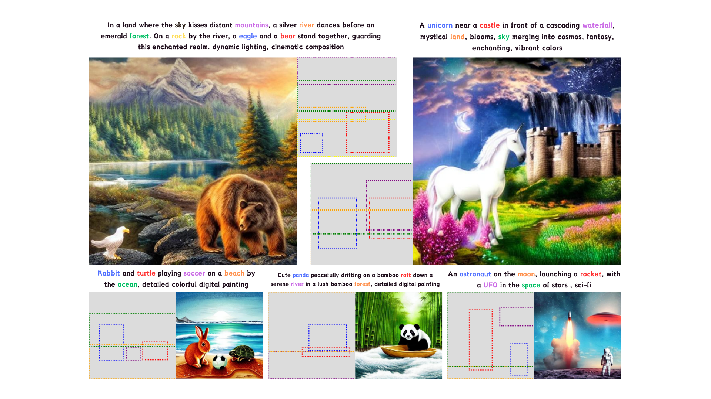

<div align="center">
<h3>Training-free Composite Scene Generation for Layout-to-Image Synthesis</h3>

Jiaqi Liu<sup>1</sup>&nbsp; Tao Huang<sup>1</sup>&nbsp; Chang Xu<sup>1</sup>

<sup>1</sup> Schoold of Computer Science, Faculty of Engineering, The University of Sydney

[](https://arxiv.org/abs/2407.13609)

</div>



### Image Generation
The Layout-to-Image generation process requires a prompt, bounding boxes, and attending indices, which can be modified in generate.py. The outputs are saved as PNG files in the specified path. Configuration settings are located in config.py.
```
python generate.py
```

### Evaluation
The method is evaluated using YOLOv7, available [here](https://github.com/WongKinYiu/yolov7). CLIP score measurement utilizes the model available [here](https://huggingface.co/openai/clip-vit-base-patch16). A sample dataset with layouts of two objects, as described in the paper, is provided in the docs folder.

### Citation
``` 
@misc{liu2024trainingfreecompositescenegeneration,
      title={Training-free Composite Scene Generation for Layout-to-Image Synthesis}, 
      author={Jiaqi Liu and Tao Huang and Chang Xu},
      year={2024},
      eprint={2407.13609},
      archivePrefix={arXiv},
      primaryClass={cs.CV},
      url={https://arxiv.org/abs/2407.13609}, 
}
```

## To Be Provided

- [ ] Examples for generation

## Acknowledgements

This research is supported in part by the Australian Research Council under Projects DP210101859 and FT230100549.
This work is inspired by [layout-guidance](https://github.com/silent-chen/layout-guidance), [BoxDiff](https://github.com/showlab/BoxDiff/tree/master), and [Diffusers](https://github.com/huggingface/diffusers).
